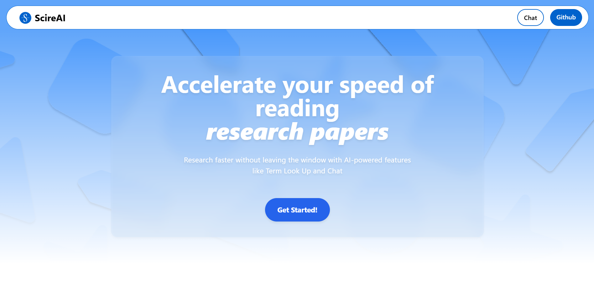

<h1 align="center">Scire AI</h1>
<p align="center">Your research assistant AI for an enhanced research experience.</p>
<p align="center">
  
</p>

---

Scire AI is a research assistant AI designed to enhance your research experience. With Scire AI, you can upload PDF files, select text you don’t understand, and ask AI for explanations—all within the same window.

## Features

- **PDF Viewer:** Open and read any PDF file in the app.
- **Text Selection & AI Assistance:** Highlight text in the PDF, right-click, and query the AI for clarification.
- **Integrated AI Chat:** Chat with AI in a dedicated panel for seamless interaction.

## Demo

🔗 [Scire AI Demo](https://scireai.vercel.app/)  
Experience the functionality of Scire AI in a simulated environment.

## Installation

Follow the instructions below to set up Scire AI locally.

### Prerequisites

- Node.js (v16 or later)
- npm (v7 or later)

### Steps

1. Clone the repository:
   ```bash
   git clone git@github.com:unknown7703/scireai.git
